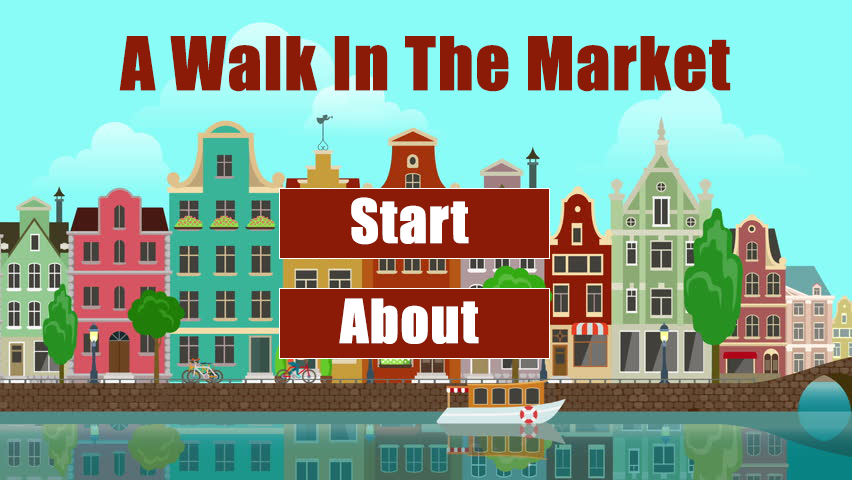
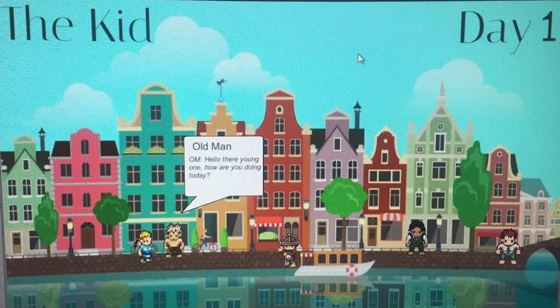

# A-Walk-in-The-Market
A dialogue based game where you play as five characters in a European market

## How To Run
This project can be run in two ways….
1)	This way to run the project is only possible on Windows OS. For this option, go to A-Walk-In-The-Market/Game and simply run the exe file. Choose this option if you just want to run the game.
2)	If you have Unity installed, you can also download this whole project and open this game in Unity. This gives you the possibility to modify this game.

## The Point of this Game
"A Walk in the Market" was made to allow players to explore characters resembling everyday values and experiences for immersion, relatability, and entertainment 	

## How to Play
### Controls
##### A or Left Arrow 
go left 
#### D or Right Arrow 
go right 
#### Left Shift 
begin conversation with character 
#### Space 
continue conversation with character 

### Rules
This game has one rule: complete four interactions as each player. This game last five days, so a player has a total of 20 interactions. An interaction in this game is one conversation between characters where the dialogue box stays up. To interact with a character, get near the character and press shift.

### Multiple Playthroughs
In order to experience all the dialogue in the game, a player must play this game multiple times. Each day, there are a total of 15 possible interactions, but a player only chooses 4 interactions. Therefore, you must meticulosity pick what character you want to interact with.

## In-Game Images

## Credits
### Luca Bonini 
Wrote dialogue
### JJ Stewart (https://github.com/jjstew35)
Acquired the art assets for this game using/editing royalty free art
### Music 
The music used for this game is royalty free and can be found at https://www.youtube.com/watch?v=kCvKqZljhxE and https://www.youtube.com/watch?v=XgpxpTe5pus 
